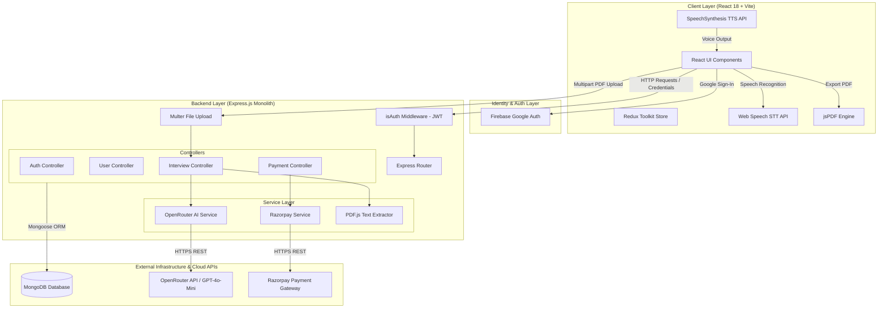

# Cortex — AI-Powered Mock Interview & Evaluation Platform

> A full-stack AI interview platform that parses candidate resumes, dynamically generates role-specific interview questions, conducts voice-guided interview sessions via browser speech synthesis and recognition, and evaluates performance across technical and communication dimensions using LLM-driven structured analysis.

---

## Problem Statement

### The Problem
Preparing for technical and behavioral interviews requires realistic practice with immediate, objective feedback. Traditional interview preparation suffers from several structural flaws:

1. **Static Question Banks**: Static list-based platforms (e.g., generic LeetCode text lists or static interview question lists) fail to adapt to a candidate's specific resume context, target role, or experience level.
2. **High Cost of Human Mock Interviews**: Peer-to-peer or professional mock interviews are expensive, difficult to schedule, and lack consistent quantitative evaluation metrics.
3. **Absence of Real-Time Verbal Practice**: Most preparation platforms rely on written text input, failing to simulate the stress, pacing, time constraints, and spoken articulation required during actual live interviews.

### The Objective
Cortex was built to bridge this gap by providing an automated, low-latency mock interview environment that combines **PDF resume text extraction**, **contextual LLM question generation**, **browser-native speech processing (STT/TTS)**, and **credit-based monetization with Razorpay integration**.

---

## Solution & User Workflow

Cortex replaces static preparation with a 3-step interactive interview lifecycle:

```
[Candidate] ──► Google OAuth ──► JWT Cookie Issued
     │
     ▼
[Step 1: Setup] ──► Upload Resume (PDF) ──► PDF.js Text Extraction ──► GPT-4o-Mini Parsing (Skills/Projects)
     │
     ▼
[Credit Verification] ──► Deduct 50 Credits ──► Generate 5 Difficulty-Progressive Questions
     │
     ▼
[Step 2: Interview Session] ──► SpeechSynthesis Question Prompting ──► Timer Countdown (60s-120s)
     │                                                                     │
     └────── WebKit SpeechRecognition (STT) ◄── Spoken Candidate Response ─┘
                                   │
                                   ▼
                   Submit Answer ──► LLM Scoring (0-10) & 15-word Feedback
                                   │
                                   ▼
[Step 3: Analytics] ──► Aggregate Scores ──► Render Recharts Trend & Export PDF (jsPDF)
```

1. **Authentication & Identity**: User authenticates via Google Firebase Auth, receiving an HTTP-only JWT cookie (`sameSite: strict`, 7-day validity).
2. **Resume Ingestion & Context Parsing**: Candidate uploads a PDF resume. Backend extracts raw text using `pdfjs-dist` and sends it to `openai/gpt-4o-mini` via OpenRouter to extract structured skills, projects, role, and experience.
3. **Adaptive Question Generation**: System verifies credit balance (minimum 50 credits required), deducts credits atomically, and generates 5 tailored questions with progressive difficulty (`easy` → `easy` → `medium` → `medium` → `hard`).
4. **Voice-Guided Interview Execution**: Browser Web Speech API (`window.speechSynthesis`) reads questions aloud while an animated avatar syncs visually. Candidate speaks their response, converted to text in real-time via `webkitSpeechRecognition`.
5. **Automated LLM Evaluation**: On submission or timer expiration, backend evaluates answers against confidence, communication, and correctness (0-10 scale), generating concise human-like feedback.
6. **Analytics & PDF Export**: Final session metrics are saved to MongoDB, rendered visually with Recharts area graphs and circular progress bars, and exported to PDF format via `jsPDF`.

---

## Key Features

### 1. PDF Resume Parsing & Context Extraction
* **User Capability**: Candidates upload a resume PDF to auto-populate target role, experience, key projects, and core technical skills.
* **Technical Implementation**: Express backend processes `multipart/form-data` uploads using Multer ([`server/middlewares/multer.js`](file:///d:/ResumeProjects/cortex-app/server/middlewares/multer.js)). Text is extracted page-by-page using `pdfjs-dist/legacy/build/pdf.mjs` ([`server/controllers/interview.controller.js`](file:///d:/ResumeProjects/cortex-app/server/controllers/interview.controller.js#L7-L82)), cleaned via regex, and parsed into a strict JSON schema by `openai/gpt-4o-mini` via OpenRouter.

### 2. Contextual Question Generation with Difficulty Progression
* **User Capability**: Generates 5 tailored, single-sentence interview questions adapted to role, experience, mode (Technical vs HR), and extracted resume skills.
* **Technical Implementation**: Backend controller ([`generateQuestion`](file:///d:/ResumeProjects/cortex-app/server/controllers/interview.controller.js#L85-L223)) validates user credit balance ($ \ge 50 $ credits), constructs a structured system prompt specifying 15-25 word single-sentence bounds and strict difficulty scaling (`easy` to `hard`), and creates a persistent `Interview` document in MongoDB with question-specific time limits (60s for easy, 90s for medium, 120s for hard).

### 3. Hands-Free Voice Interviewing & Avatar Pacing
* **User Capability**: Candidates listen to the AI interviewer read questions aloud and speak their responses hands-free.
* **Technical Implementation**: Frontend ([`Step2Interview.jsx`](file:///d:/ResumeProjects/cortex-app/client/src/components/Step2Interview.jsx)) integrates browser-native `SpeechSynthesisUtterance` configured with rate ($0.92$) and pitch ($1.05$) parameters for human-like cadence, synchronized with animated avatar video playback. Speech-to-Text is handled via continuous `webkitSpeechRecognition` streaming directly into the response state.

### 4. Dimensional Answer Scoring & Feedback
* **User Capability**: Every answer receives instant feedback and independent scores for Confidence, Communication, and Correctness.
* **Technical Implementation**: Controller ([`submitAnswer`](file:///d:/ResumeProjects/cortex-app/server/controllers/interview.controller.js#L226-L334)) evaluates responses using OpenRouter LLM structured JSON output. Enforces rules for missing answers (score 0, canned feedback) and time-limit violations ($t_{\text{taken}} > t_{\text{limit}}$). Calculates an overall rounded integer score and saves question-level scores to MongoDB.

### 5. Credit System & Razorpay Payment Verification
* **User Capability**: Users manage credit balances and purchase additional credits via secure online payments.
* **Technical Implementation**: Integrates Razorpay Orders API ([`payment.controller.js`](file:///d:/ResumeProjects/cortex-app/server/controllers/payment.controller.js)). On payment completion, backend computes HMAC SHA-256 signature using `crypto` module, compares it with `razorpay_signature`, and atomically updates user credit balance via MongoDB `$inc` operator.

### 6. Analytics Dashboard & PDF Report Generation
* **User Capability**: View visual performance trends across questions and export complete interview reports to PDF.
* **Technical Implementation**: Rendered using Recharts `AreaChart` and `react-circular-progressbar`. Report generation ([`Step3Report.jsx`](file:///d:/ResumeProjects/cortex-app/client/src/components/Step3Report.jsx#L56-L165)) uses `jsPDF` and `jspdf-autotable` to dynamically format scores, advice, and detailed question-feedback breakdown tables into a downloadable client-side PDF document.

---

## System Architecture



### Component Responsibilities

* **Client Layer (`client/src`)**: Single Page Application built with React 18, Vite, Redux Toolkit, and TailwindCSS. Handles UI state transitions, browser voice capture/synthesis, and client-side PDF generation.
* **Middleware Layer (`server/middlewares`)**: `isAuth.js` validates JWT tokens stored in HTTP-only cookies. `multer.js` handles temporary disk storage (`uploads/`) for incoming PDF resumes.
* **Interview Controller (`server/controllers/interview.controller.js`)**: Core orchestration logic for resume parsing, question prompt construction, answer evaluation, score aggregation, and credit deduction.
* **OpenRouter Service (`server/services/openRouter.service.js`)**: Encapsulates HTTP communication with OpenRouter REST API (`https://openrouter.ai/api/v1/chat/completions`) using Axios and model `openai/gpt-4o-mini`.
* **Payment Service (`server/services/razorpay.service.js`)**: Configures Razorpay SDK client with API key credentials.
* **MongoDB (`server/models`)**: Persistent storage for `User`, `Interview` (embedding questions, scores, feedback), and `Payment` documents.

---

## Request / Data Flow

### 1. Resume Upload & Structuring Flow
```
User selects PDF file
 └──> Client constructs FormData & sends POST /api/interview/resume
       └──> Multer middleware saves file to disk temporarily
             └──> Controller reads file buffer into Uint8Array
                   └──> PDF.js iterates pages & extracts plain text
                         └──> Backend unlinks local temp file
                               └──> OpenRouter API parses text into structured JSON
                                     └──> Client populates setup form with role/skills/projects
```

### 2. Question Generation & Credit Deduction Flow
```
User clicks "Start Interview"
 └──> Client sends POST /api/interview/generate-questions
       └──> isAuth middleware validates JWT from HTTP-only cookie
             └──> Controller checks User.credits >= 50
                   └──> System prompt constructed with candidate context
                         └──> OpenRouter API generates 5 questions
                               └──> Controller deducts 50 credits from User in MongoDB
                                     └──> Interview document created with status "Incompleted"
                                           └──> Response returns questions & remaining credits to Client
```

### 3. Speech-to-Text Answer Evaluation Flow
```
Client plays question via SpeechSynthesisTTS
 └──> Candidate speaks response into microphone
       └──> webkitSpeechRecognition appends text transcript to state
             └──> Candidate clicks Submit (or timer hits 0s)
                   └──> Client sends POST /api/interview/submit-answer
                         └──> Controller checks timeTaken vs question.timeLimit
                               └──> If valid, OpenRouter API scores Confidence, Comm, Correctness
                                     └──> Interview document updated with scores & 15-word feedback
                                           └──> Client plays feedback aloud via TTS
```

---

## Tech Stack

| Domain | Technology | Justification |
| :--- | :--- | :--- |
| **Frontend** | React 18 + Vite | Rapid component rendering, fast HMR development, and light bundle size. |
| **State Management** | Redux Toolkit | Centralized persistent client state for active user profile and credit balances. |
| **Styling & Motion** | TailwindCSS + Motion | Utility-first styling with hardware-accelerated micro-animations (`motion/react`). |
| **Data Visualization** | Recharts + Progressbar | SVG-based area charts and circular progress components for interview analytics. |
| **Backend Framework** | Node.js + Express.js | Event-driven non-blocking I/O ideal for API routing and asynchronous LLM integration. |
| **Database** | MongoDB + Mongoose | Flexible document model allowing embedded sub-document schemas for interview questions and scores. |
| **Authentication** | Firebase Auth + JWT | Client-side Google OAuth combined with secure server-managed HTTP-only JWT cookies. |
| **AI Integration** | OpenRouter (`gpt-4o-mini`) | Cost-effective, low-latency access to GPT-4o-Mini model with strict JSON formatting capabilities. |
| **PDF Extraction** | `pdfjs-dist` (Mozilla) | Reliable server-side extraction of text content from PDF binary buffers. |
| **Payment Gateway** | Razorpay Node SDK | Automated order creation and cryptographic HMAC SHA-256 payment verification. |
| **DevOps / Containers**| Docker | Multi-stage build process packaging client build assets and Node.js runtime into an Alpine image. |

---

## Repository Structure

```text
cortex-app/
├── client/                     # Vite + React Frontend Application
│   ├── src/
│   │   ├── assets/             # Media assets (videos for AI avatars, images)
│   │   ├── components/         # Step1SetUp, Step2Interview, Step3Report, Timer, Navbar
│   │   ├── pages/              # Auth, Home, InterviewHistory, Pricing
│   │   ├── redux/              # Redux store and userSlice
│   │   └── utils/              # Firebase configuration initialization
│   ├── package.json
│   └── vite.config.js
├── server/                     # Node.js + Express REST API Server
│   ├── config/                 # Database connection & JWT generator utilities
│   ├── controllers/            # Auth, Interview, User, and Payment controllers
│   ├── middlewares/            # JWT authentication (isAuth) and Multer file upload
│   ├── models/                 # Mongoose schemas (User, Interview, Payment)
│   ├── routes/                 # Express API route declarations
│   ├── services/               # OpenRouter AI & Razorpay service integrations
│   ├── public/                 # Static production build folder (populated during Docker build)
│   ├── index.js                # Server entry point & static SPA router
│   └── package.json
├── .dockerignore               # Docker build exclusion rules
├── .gitignore                  # Git repository exclusion rules
├── Dockerfile                  # Multi-stage Docker build specification
└── README.md                   # Technical project documentation
```

---

## Engineering Decisions

### 1. Client-Side Speech APIs vs Server-Side Audio Streaming
* **Decision**: Utilize browser-native Web Speech API (`webkitSpeechRecognition` and `SpeechSynthesisUtterance`) instead of streaming raw PCM audio to backend Whisper/TTS models.
* **Reason**: Reduces server infrastructure costs, eliminates audio bandwidth transfer overhead, and delivers zero-latency text-to-speech rendering on client devices.
* **Alternative**: Server-side WebRTC / WebSocket audio pipeline using OpenAI Whisper API and ElevenLabs TTS.
* **Trade-off**: Speech recognition quality relies on browser vendor support (primarily Chrome/Chromium) and local microphone setup.

### 2. Multi-Stage Docker Build Architecture
* **Decision**: Use a 2-stage Docker build (`client-builder` → `runner`) serving compiled static frontend files directly via Express.
* **Reason**: Eliminates the need for separate Nginx/CORS setups in basic deployments. Single container handles both REST endpoints and frontend SPA asset delivery.
* **Alternative**: Separate Docker containers for Vite frontend (Nginx) and Express backend.
* **Trade-off**: Increases backend container memory footprint slightly due to static file serving responsibilities.

### 3. OpenRouter Abstraction Layer for LLM Calls
* **Decision**: Route all AI prompts through OpenRouter REST API using Axios rather than vendor-specific SDKs.
* **Reason**: Provides flexibility to switch underlying models (e.g., GPT-4o-mini to Claude 3 Haiku or Llama 3) via simple configuration changes without altering controller logic.
* **Alternative**: Direct integration with `openai` NPM package.
* **Trade-off**: Introduces a third-party API gateway dependency between backend and model providers.

### 4. HMAC SHA-256 Cryptographic Signature Verification for Payments
* **Decision**: Verify Razorpay payment webhooks/responses using Node.js `crypto` HMAC SHA-256 hash comparison.
* **Reason**: Prevents client-side payment forgery and ensures credit balances are only incremented after authentic gateway confirmation.
* **Alternative**: Trusting client-side payment success callbacks directly.
* **Trade-off**: Requires strict key management for `RAZORPAY_KEY_SECRET` across environments.

---

## Challenges & Solutions

### 1. PDF Text Parsing Instability Across Complex Formatting
* **Challenge**: Extracting clean text from user-uploaded PDFs resulted in broken sentences, missing whitespace, and extra line breaks, confusing the LLM prompt context.
* **Root Cause**: PDF binary format stores glyphs with spatial coordinates rather than semantic paragraph structures.
* **Solution**: Implemented sequential page parsing via `pdfjs-dist` coupled with regex normalization (`replace(/\s+/g, " ")`) to produce clean text strings before LLM ingestion ([`interview.controller.js`](file:///d:/ResumeProjects/cortex-app/server/controllers/interview.controller.js#L31-L33)).
* **Engineering Lesson**: Raw extracted text must always be normalized and sanitized before passing into structured prompt pipelines.

### 2. Synchronizing AI Voice Synthesis with Video Avatar State
* **Challenge**: The animated AI avatar video needed to play smoothly while the question was spoken and stop immediately when speech completed.
* **Root Cause**: `window.speechSynthesis` operates asynchronously outside the React render lifecycle.
* **Solution**: Wrapped `SpeechSynthesisUtterance` in JavaScript Promises with explicit `onstart` and `onend` event handlers attached to DOM video elements ([`Step2Interview.jsx`](file:///d:/ResumeProjects/cortex-app/client/src/components/Step2Interview.jsx#L86-L137)).
* **Engineering Lesson**: Imperative browser APIs must be wrapped in Promise constructs to interface cleanly with declarative React state cycles.

### 3. Intermittent Speech Recognition Drops During Long Responses
* **Challenge**: `webkitSpeechRecognition` would automatically disconnect or stop capturing transcript after pauses.
* **Root Cause**: Browser speech recognition engines enforce internal silence timeouts.
* **Solution**: Configured `recognition.continuous = true` and attached continuous transcript concatenation (`setAnswer(prev => prev + " " + transcript)`) in the `onresult` listener ([`Step2Interview.jsx`](file:///d:/ResumeProjects/cortex-app/client/src/components/Step2Interview.jsx#L210-L221)).
* **Engineering Lesson**: Web Speech APIs require defensive event handling to handle unexpected browser-triggered state terminations.

---

## Security Considerations

### Implemented Security Controls
* **HTTP-Only Cookies**: JWT tokens are issued with `httpOnly: true` and `sameSite: "strict"` flags, preventing XSS-based token theft ([`auth.controller.js`](file:///d:/ResumeProjects/cortex-app/server/controllers/auth.controller.js#L16-L21)).
* **Cryptographic Signature Verification**: Razorpay payment authenticity is validated server-side using HMAC SHA-256 signature matching ([`payment.controller.js`](file:///d:/ResumeProjects/cortex-app/server/controllers/payment.controller.js#L47-L54)).
* **Temporary Upload Cleanup**: Uploaded PDF files are unlinked from local disk storage immediately after text extraction ([`interview.controller.js`](file:///d:/ResumeProjects/cortex-app/server/controllers/interview.controller.js#L62)).

### Security Improvements Needed for Production
* **Rate Limiting**: Implement `express-rate-limit` on `/api/interview/generate-questions` and `/api/auth/google` to prevent API denial-of-service or credit drain attacks.
* **Input Sanitization**: Add schema validation (e.g., Zod or Joi) on request bodies to enforce strict bounds on `role`, `experience`, and candidate answers.
* **File Type & Size Verification**: Validate PDF magic bytes on Multer uploads to prevent executable file masking.

---

## Performance & Scalability

### Bottlenecks & Limitations
1. **Synchronous LLM API Latency**: Question generation and answer evaluation rely on external OpenRouter REST calls, taking 1.5s–3.5s per request depending on model load.
2. **Monolithic Container Memory**: Serving static Vite assets and managing PDF buffer extraction within the same Express process limits horizontal CPU scaling efficiency.
3. **Single Database Instance**: MongoDB operations currently execute against a primary instance without read-replica splitting.

### Scaling Strategy
* **Caching Layer**: Introduce Redis to cache frequent candidate roles and pre-generated practice questions.
* **Asynchronous Queueing**: Offload answer evaluation to background worker queues (e.g., BullMQ + Redis) so candidate transitions to subsequent questions without blocking on HTTP responses.
* **CDNs for Static Assets**: Serve client JS/CSS bundles and avatar MP4 videos via AWS CloudFront CDN instead of Node.js static middleware.

---

## Running Locally

### Prerequisites
* **Node.js**: v18.x or higher
* **MongoDB**: Local instance or MongoDB Atlas connection string
* **OpenRouter API Key**: Account at [openrouter.ai](https://openrouter.ai)
* **Razorpay Credentials**: Key ID and Secret from Razorpay Dashboard

### 1. Environment Setup

Create `server/.env`:
```env
PORT=8000
MONGO_URI=mongodb://localhost:27017/cortex
JWT_SECRET=your_super_secret_jwt_key
OPENROUTER_API_KEY=your_openrouter_api_key
RAZORPAY_KEY_ID=your_razorpay_key_id
RAZORPAY_KEY_SECRET=your_razorpay_key_secret
```

Create `client/.env`:
```env
VITE_FIREBASE_APIKEY=your_firebase_api_key
```

### 2. Installation & Running

#### Backend Server
```bash
cd server
npm install
npm run dev
```

#### Frontend Client
```bash
cd client
npm install
npm run dev
```

### 3. Docker Deployment (Local Container Test)

```bash
# Build unified Docker container
docker build -t cortex-app .

# Run container mapping port 8000
docker run -d -p 8000:8000 --env-file server/.env --name cortex-instance cortex-app
```
